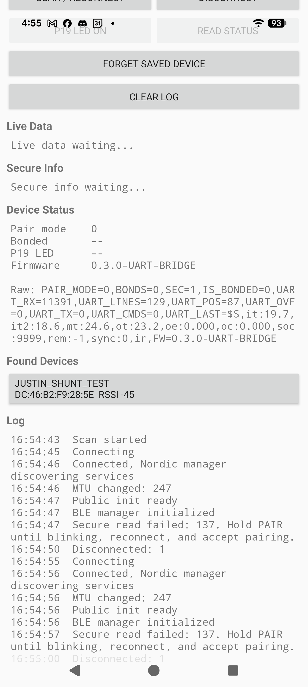
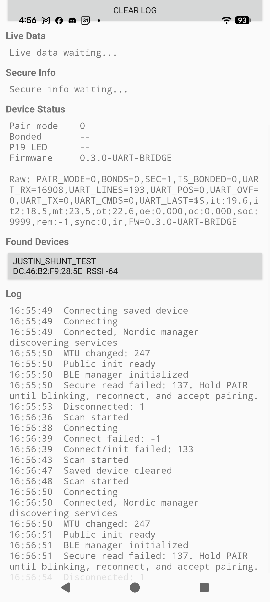

# Phase 1 UART Bridge Status - 2026-05-21

## Current Firmware

- Firmware version: `0.3.0-UART-BRIDGE`
- BLE device name: `Justin_Shunt_Test`
- Verified hardware target: standalone E73 / nRF52840 module
- UART mapping verified on the standalone module:
  - nRF52840 `P0.06` = UART TX -> STM32 `PA3 / USART2_RX`
  - nRF52840 `P0.08` = UART RX <- STM32 `PA2 / USART2_TX`
  - UART: 9600 8N1, no hardware flow control
- Pairing:
  - Test-board SW3 maps to `P0.20` and enters pair mode after a long press.
  - The standalone module used for the final UART test has no SW3 button wired.
  - Reading secure info (`12345678-1234-5678-1234-56789abcdef4`) triggers Android pairing while pair mode is active.

## BLE Interface

- JSS service: `12345678-1234-5678-1234-56789abcdef0`
- Live data: `...def1` read + notify
- LED control: `...def2` encrypted write
- Device status: `...def3` read + notify
- Secure info: `...def4` encrypted read
- UART command: `...def5` write / write without response
- UART response: `...def6` read + notify
- Nordic UART Service remains present for compatibility/debugging.

## UART Diagnostics In Device Status

The `...def3` status string now includes:

- `UART_RX`: total bytes received by nRF on `P0.08`
- `UART_LINES`: complete newline-terminated UART lines
- `UART_POS`: bytes currently buffered without a newline
- `UART_OVF`: UART line buffer overflows
- `UART_TX`: bytes transmitted by nRF on `P0.06`
- `UART_CMDS`: BLE `...def5` command writes forwarded to UART
- `UART_LAST`: latest received UART line, truncated for status display

These counters were added only for bring-up diagnosis and can be kept through Phase 1.

## Result From Final Standalone Module Test

The standalone E73/nRF52840 module received realistic STM32 telemetry. The app showed:

- `UART_RX=11391`, `UART_LINES=129`, `UART_POS=87`
- Later `UART_RX=16908`, `UART_LINES=193`, `UART_POS=0`
- `UART_LAST` contained STM32 `$S,...` data, including temperature and SOC fields.

This confirms:

- nRF UART pin direction is correct.
- nRF UART RX interrupt path is working.
- STM32 `PA2` data can reach nRF `P0.08`.
- BLE status readout can expose the UART counters and latest line.

Screenshots:

## Test Board Issue

The EWT73 test board did not receive UART data after connecting STM32. Scope observations showed that after connecting STM32, the UART low level changed from approximately `0 V` to around `1.x V` while the high level remained near `3.3 V`.

The standalone module receiving data points away from firmware and toward the test board electrical environment:

- unreliable or high-impedance common ground
- CH340 / jumper influence on the UART nets
- test-board peripheral loading or ground return path issue

Next hardware check should focus on `STM32 PA2 -> nRF P0.08` using the nRF ground as the oscilloscope reference, with a short direct ground between STM32 and nRF.

## Current Recommendation

Continue Phase 1 integration on the standalone E73/nRF52840 module. Keep the UART diagnostic status fields until the test-board grounding/jumper issue is understood.
